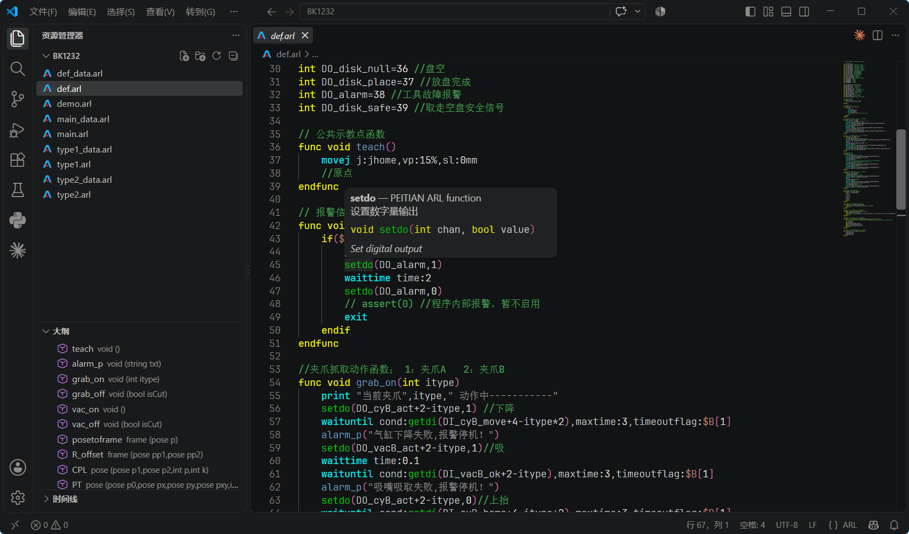
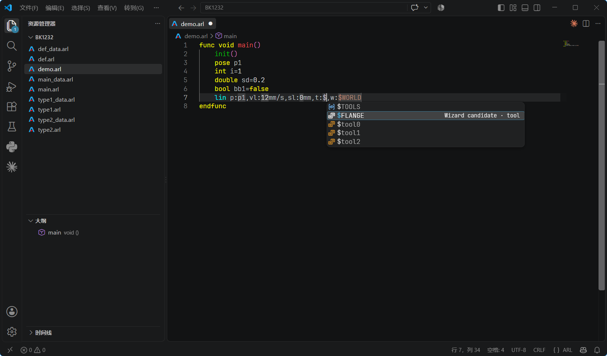
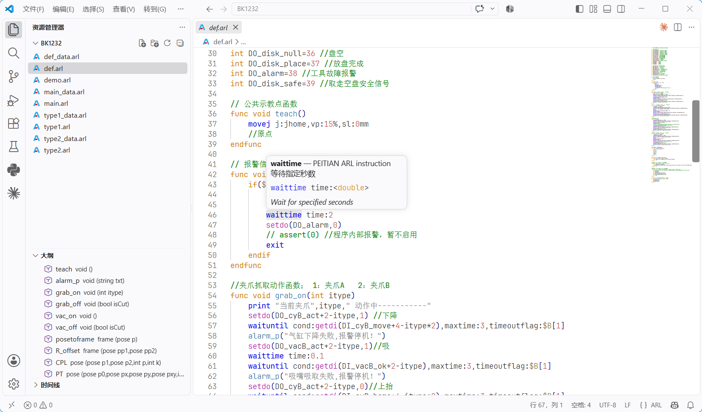
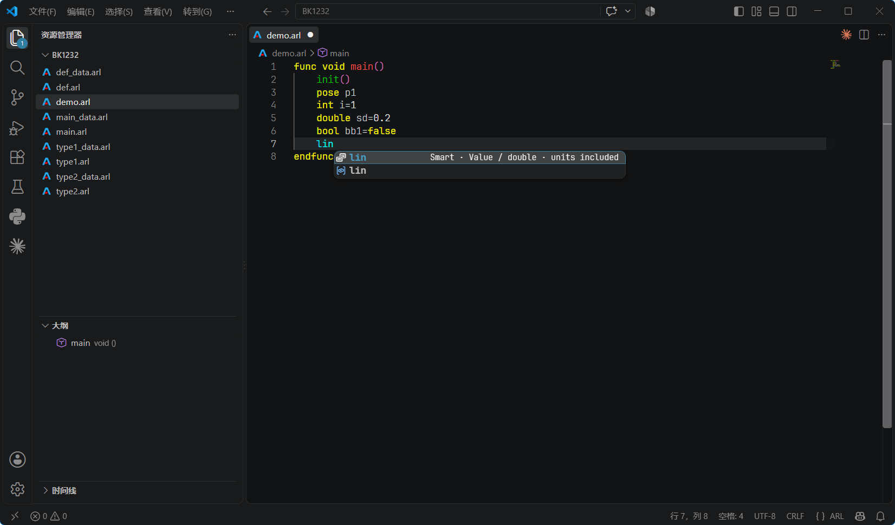
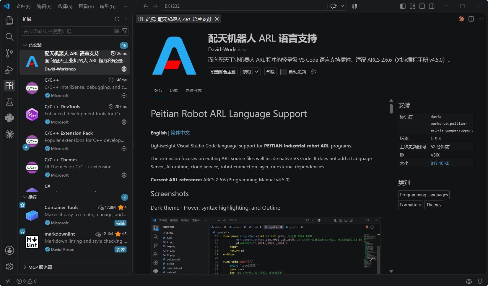

# 配天机器人 ARL 语言支持

**简体中文** | [English](#english)

面向 **配天（PEITIAN）工业机器人 ARL** 程序的轻量级 Visual Studio Code 语言支持插件。

本插件专注于让 `.arl` 文件在原生 VS Code 中获得良好的编辑体验，不引入 Language Server、AI 运行时、云服务、机器人在线连接层，也没有生产环境 npm 依赖。

**当前 ARL 参考版本：** ARCS 2.6.6（对应编程手册 v4.5.0）。

## 截图

### 深色主题 · Hover、高亮与大纲



### 深色主题 · 程序整体效果



### 浅色主题 · 高亮与大纲



### IntelliSense 代码补全



### 插件详情页



## 功能

- `.arl` 文件识别与专属文件图标
- 基于配天 ARL 编辑器 Black / Light 配色的语法高亮
- JetBrains Mono / Cascadia Code 精确字重适配
- 智能缩进与全文格式化
- ARL 代码块折叠
- Outline、大纲、Breadcrumbs 与 `Ctrl+Shift+O` 函数导航
- `F12` / `Ctrl+点击` 跳转用户函数定义
- 支持 `file::func()` 形式的跨文件函数跳转
- ARL 指令、逻辑关键字、数据类型、函数、系统变量 Hover 说明
- ARL 关键字、指令、函数、变量、系统变量 IntelliSense
- Wizard 驱动的通用参数类型感知补全（指令与函数）
- 可开关的 Smart Completion 结构化补全（运动指令、函数、控制结构）
- 内置 ARL 调用与用户函数 Signature Help 参数提示
- `//` 行注释与 `/* ... */` 块注释高亮

## 类型感知补全

ARL 补全尽量保持简单、可预测。

在自由输入状态下，至少输入一个字符后才开始联想：

```arl
p
```

此时可以匹配不同类别，例如 `ptp`、`pose`、`print` 以及已声明变量。

当上下文已经明确参数类型时，只显示兼容类型的已声明变量：

```arl
pose pHome
pose pPick
joint jHome
speed vFast

ptp p:p
```

因为 `p:` 要求 `pose`，所以候选会包含 `pHome`、`pPick` 等 `pose` 变量，而不会混入无关指令、`joint` 或 `speed` 变量。这只是运动指令示例；实际筛选由完整 ARL Wizard 参数元数据驱动，同样适用于普通指令和函数的位置参数。

在已经明确类型的参数位置，**未输入首字符时不显示候选**。输入第一个字符后才开始类型感知 + 严格前缀筛选：输入 `p` 只保留 `p...` 普通变量；输入 `$` 只保留系统变量；输入数值前缀同样严格匹配，因此手工输入 `22` 时不会再让 `250` 之类不匹配的候选抢走 Tab / Enter。对于 `$P`、`$D` 等数组型系统变量，输入 `$` 后可选择基础变量并自动插入 `$P[]` / `$D[]`，光标进入方括号；已实际使用过的 `$P[21]` 也会在前缀匹配时作为完整候选复用。

常见运动指令命名参数示例（不是完整支持范围）：

| 参数上下文 | 期望类型 |
| --- | --- |
| `p:` | `pose` |
| `j:` | `joint` |
| `v:` | `speed` |
| `s:` | `slip` |
| `t:` | `tool` |
| `w:` | `wobj` |

通用筛选会读取当前参数在 Wizard 中声明的类型，例如 `bool`、`string`、`int`、`double`、`pose`、`joint`、`speed`、`slip`、`tool`、`wobj`、`socket`、`byte[]` 和 `function`。候选依次来自：当前可见且类型兼容的已声明变量、Wizard 文档候选，以及附近代码中同一指令或函数参数仍在使用的值。类型为 `any` 的参数会有意允许多种类型；没有 Wizard 或 TIPS 参数定义的未知调用则无法推断类型。

已声明变量候选只读取当前 ARL 文件，以及同目录下与其配套的 `<程序名>_data.arl` 文件；配套数据文件会缓存在内存中，因此其他程序的变量不会混入当前程序的联想列表。

## Smart Completion 智能结构补全

`Peitian Robot ARL › Smart Completion` 默认开启，并且可以单独关闭；关闭后不会影响普通 IntelliSense。

开启后，常用 ARL 结构可以作为可编辑模板插入。例如选择 `ptp` 时会提供两种常用结构：

```arl
ptp p:,vp:,sp:,t:,w:
ptp p:,v:,s:,t:,w:
```

插件只负责自动写入固定语法结构（例如 `p:`、`v:`、`s:`、`t:`、`w:`），所有参数值仍然是可编辑的 Tab Stop。空参数位置保持安静；输入第一个字符后才启动类型感知、严格前缀补全。你可以从匹配候选中选择，也可以继续手工输入自定义变量名或数值。**Tab** 负责进入下一个占位符，**Enter** 可以正常结束 Smart Snippet 并换行，上一行参数不会继续保持占位符高亮。

Smart Completion 现在改为 **Wizard 数据驱动**。插件完整打包参考版配天 ARL 编辑器内嵌的 Wizard 数据，把参数类型、必填/可选、Variant、候选项、单位和中英文说明映射成 VS Code 原生 Snippet 与 IntelliSense；运动指令继续保留经过实际使用优化的模板。只有内置函数没有详细 Wizard Variant 时，才安全回退到原编辑器 TIPS 中的真实函数原型，因此 131 个 ARL 内置函数都可以从原始资料生成结构化补全，不会凭空猜测函数签名。

例如：

```arl
waituntil cond:getdi(1)
setdo(1, 1)
offset(p1, dx, dy, dz, rz, ry, rx)
```

有可选参数的指令会同时提供“仅必填参数”和“完整参数”两种结构；像 `setdo` 这种原 Wizard 中存在“单通道 / 多通道” Variant 的函数，会在 VS Code 中分别给出对应模板。

通用原型解析同时支持原资料中的多重签名、可选参数、数组参数，以及 `joint j1, j2, j3` 这类连续参数类型写法。Wizard 与 TIPS 不一致时，以参数更详细的 Wizard 为准；例如 `connect` 使用 `connect(socket, host, port)`。

所有 Wizard 参数统一使用同一套候选来源优先级：**① 当前代码中类型匹配的已声明变量 → ② Wizard 文档中写好的候选项 → ③ 当前源码中仍然存在的、同一指令参数最近使用值**。但候选只在输入首字符后出现，并且三类来源都要继续通过严格前缀筛选。已经删除的临时输入不会作为持久历史污染候选，不相关的内置标量系统变量也不会混进普通 `double` / `int` 参数。

单位规则同样用于手工参数补全：例如在 `vl:` 中选择 `250` 或一个 `double` 变量时，插件会自动补上固定的 `mm/s`；`%`、`mm` 参数同理。

`if`、`while`、`for`、`loop`、`repeat`、`switch`、`func` 等控制结构继续提供完整代码块模板。

关闭 Smart Completion 后，普通 ARL 联想、类型筛选、Hover、参数提示、格式化和跳转功能仍然保持正常。

## 常用快捷键

插件遵循 VS Code 原生快捷键：

| 操作 | Windows / Linux |
| --- | --- |
| 行注释 / 取消注释（`//`） | `Ctrl+/` |
| 全文格式化 | `Shift+Alt+F` |
| 手动触发 IntelliSense | `Ctrl+Space` |
| 手动触发参数提示 | `Ctrl+Shift+Space` |
| 跳转到定义 | `F12` |
| 当前文件函数列表 | `Ctrl+Shift+O` |
| 折叠当前区域 | `Ctrl+Shift+[` |
| 展开当前区域 | `Ctrl+Shift+]` |
| 折叠全部 | `Ctrl+K`，再按 `Ctrl+0` |
| 展开全部 | `Ctrl+K`，再按 `Ctrl+J` |

ARL 行注释使用 `//`，块注释使用 `/* ... */`。

## 格式化

`Shift+Alt+F` 会按照 ARL 的代码块语义格式化整个文件：

```text
OPEN:   func / if / while / for / loop / switch / repeat / interrupt / timer / trigger
CLOSE:  endfunc / endif / endwhile / endfor / endloop / endswitch / until
BRANCH: elseif / else / case / default
```

`if(cond) action` 这类单行紧凑写法不会错误地让下一行继续缩进。

## Hover 与跳转

ARL 指令、函数、逻辑关键字、数据类型和内置系统变量均可提供 Hover 说明。

用户函数：

```arl
func pose calcOffset(pose src, double dx)
    ...
endfunc
```

可以通过 `F12` 或 `Ctrl+点击` 跳转定义；`def::point_offset()` 这类跨文件调用也可以定位到当前工程中的对应 ARL 文件。

## 配色与字体

插件提供可选的：

- **Peitian ARL Black**
- **Peitian ARL Light**

同时会对常见 VS Code 内置深色/浅色主题应用仅针对 ARL 的 token 配色，不影响其他编程语言。

`Peitian Robot ARL: Precise Font Weights` 默认开启。使用 JetBrains Mono 或 Cascadia Code / Cascadia Mono 时，会采用更接近配天 ARL 编辑器的分级数字字重。

JetBrains Mono 示例：

```json
"editor.fontFamily": "'JetBrains Mono', Consolas, monospace",
"editor.fontWeight": "200"
```

## 隐私与网络

本插件：

- 不会通过网络发送 ARL 源代码；
- 不包含遥测；
- 不调用 AI 服务；
- 不需要 Language Server；
- 没有生产环境 npm 依赖。

所有语言处理均在本机 VS Code 中完成。

## 定位

这是一个**轻量级 ARL Language Support 插件**。目前不提供机器人在线控制、程序执行、调试器、完整语义诊断、符号重命名、引用搜索或 AI 代码生成。

## 兼容性

- Visual Studio Code `1.85.0` 或更高版本
- Windows、macOS、Linux
- `.arl` 文件

## 安装

正式上架后，可在 VS Code 扩展市场搜索：

**Peitian Robot ARL Language Support**

本地测试可使用 **扩展 → ... → 从 VSIX 安装...** 选择 `.vsix` 文件。

## 源码与版权

项目源码公开用于透明审查、问题反馈和参考，但作者保留版权。具体条款见 [LICENSE](./LICENSE)。PEITIAN / 配天名称、商标、官方文档以及其他第三方材料的权利仍归各自权利人所有。

## 问题反馈

请通过 [GitHub Issues](https://github.com/YoyoDavidGo/Peitian-Robot-ARL-Language-Support/issues) 提交问题。建议附上 VS Code 版本、插件版本、操作系统、最小可复现 ARL 片段，以及视觉问题截图。请勿在公开 Issue 中上传客户机密程序、账号或凭据。

---

## English

[简体中文](#配天机器人-arl-语言支持) | **English**

### Peitian Robot ARL Language Support

Lightweight Visual Studio Code language support for **PEITIAN industrial robot ARL** programs.

The extension focuses on editing ARL source files well inside native VS Code. It does not add a Language Server, AI runtime, cloud service, robot connection layer, or external dependencies.

**Current ARL reference:** ARCS 2.6.6 (Programming Manual v4.5.0).

### Screenshots

#### Dark theme · Hover, syntax highlighting, and Outline


#### Dark theme · Program overview


#### Light theme · Syntax highlighting and Outline


#### IntelliSense completion


#### Extension details


### Features

- `.arl` file recognition and dedicated file icon
- ARL syntax highlighting with Black / Light palettes based on the PEITIAN ARL editor
- Precise ARL font-weight adaptation for JetBrains Mono and Cascadia Code
- Smart indentation and full-document formatting
- Code folding for ARL block structures
- Outline, Breadcrumbs, and `Ctrl+Shift+O` function navigation
- `F12` / `Ctrl+Click` jump to user-function definitions
- Cross-file navigation for calls such as `file::func()`
- Hover documentation for ARL instructions, logic keywords, data types, functions, and system variables
- IntelliSense for ARL keywords, instructions, functions, variables, and system variables
- Wizard-driven, type-aware parameter completion for instructions and functions
- Optional Smart Completion templates for motion instructions, functions, and control blocks
- Signature Help for built-in ARL calls and user functions

### Type-aware completion

ARL completion stays intentionally predictable.

In free input, suggestions start only after at least one character has been typed:

```arl
p
```

This can suggest items from multiple ARL categories such as `ptp`, `pose`, `print`, and matching declared variables.

When the parameter type is already known, suggestions are filtered by ARL type:

```arl
pose pHome
pose pPick
joint jHome
speed vFast

ptp p:p
```

The `p:` context accepts `pose`, so the list contains matching declared `pose` variables such as `pHome` and `pPick`, not unrelated instructions or `joint` / `speed` variables. This is only a motion-instruction example: the actual filtering is driven by the complete ARL Wizard parameter metadata and also applies to ordinary instructions and positional function arguments.

For motion parameters with engineering units, Smart Completion keeps the unit outside the editable placeholder. A value parameter can be either a numeric literal or a declared `double` variable. For example, both forms are valid:

```arl
lin p:p1,vl:650mm/s,sl:11mm,t:$FLANGE,w:$WORLD
lin p:p1,vl:vLinearmm/s,sl:sBlendmm,t:$FLANGE,w:$WORLD
```

For Wizard-driven single-line Smart Completion, **Tab** moves to the next parameter. The parameter stays quiet until you type its first character; then VS Code shows strictly prefix-matched, type-compatible candidates. **Enter** inserts the new line and exits the Smart snippet session, so the previous parameter no longer remains highlighted.

In a typed parameter slot, an empty prefix shows no candidates. After the first character is typed, identifier, system-variable, and numeric input all use strict prefix filtering: typing `p` keeps only `p...` pose variables, typing `$` keeps only system-variable candidates, and typing `22` cannot leave an unrelated numeric candidate such as `250` selected. Indexed system-variable arrays such as `$P` insert as `$P[]` with the cursor inside the brackets. Previously used indexed values such as `$P[21]` can be reused when their typed prefix matches.

Chinese/full-width punctuation inside ARL strings and comments is treated as normal text; VS Code Unicode-confusable highlighting remains available for actual code tokens.

Common named motion parameters (examples, not the complete supported range):

| Context | Expected type |
| --- | --- |
| `p:` | `pose` |
| `j:` | `joint` |
| `v:` | `speed` |
| `s:` | `slip` |
| `t:` | `tool` |
| `w:` | `wobj` |

Generic filtering reads each parameter's Wizard-declared type, including `bool`, `string`, `int`, `double`, `pose`, `joint`, `speed`, `slip`, `tool`, `wobj`, `socket`, `byte[]`, and `function`. Candidates are ordered as follows: visible type-compatible declared variables, Wizard-documented values, then values still used by the same instruction or function parameter in nearby source. Parameters typed as `any` intentionally accept multiple types; unknown calls without Wizard or TIPS parameter metadata cannot be type-inferred.

Declared-variable candidates come from the current ARL file plus its paired `<program>_data.arl` file in the same directory. The paired data file is cached in memory, so unrelated ARL programs do not pollute the suggestion list.

### Smart Completion

`Peitian Robot ARL › Smart Completion` is enabled by default and can be turned off independently from normal IntelliSense.

When enabled, common ARL structures can be inserted as editable snippets. For example, `ptp` provides two templates:

```arl
ptp p:,vp:,sp:,t:,w:
ptp p:,v:,s:,t:,w:
```

The fixed ARL structure (`p:`, `v:`, `s:`, `t:`, `w:`) is inserted automatically, but every value is an editable tab stop. Empty parameters do not open suggestions. Type the first character to start type-aware, strict-prefix completion; or simply continue typing your own variable name/value. Smart Completion never restricts input to the suggestion list.

For direct-value motion templates, fixed units such as `%`, `mm/s`, and `mm` are inserted automatically outside the editable numeric tab stop. For example, changing `30` to `50` yields `vp:50%` without retyping `%`. Literal templates use a Value icon, while variable templates use a Variable icon in IntelliSense.

Smart Completion is now **Wizard-driven**. The extension packages the complete ARL Wizard metadata embedded in the reference PEITIAN ARL editor — parameter type, required/optional status, variants, documented candidates, units, and descriptions — and maps it into native VS Code snippets and IntelliSense. Motion instructions keep their curated templates. The original editor's TIPS prototype is used only as a safe fallback when a function has no detailed Wizard variant, so all 131 built-in ARL functions have source-driven Smart structure without inventing undocumented signatures.

For example:

```arl
waituntil cond:getdi(1)
setdo(1, 1)
offset(p1, dx, dy, dz, rz, ry, rx)
```

Instructions with optional parameters expose a concise required-only form and a full editable form. Functions with multiple Wizard variants, such as single-channel and multi-channel `setdo`, expose separate Smart Completion entries.

The generic proto parser also preserves overloads (for example zero-argument and ranged `rand` forms), optional arguments, array parameters, and shorthand repeated types used by the original ARL references. When Wizard and TIPS disagree, the detailed Wizard parameter table takes precedence; for example, `connect` uses `connect(socket, host, port)`.

Parameter candidates use one common source priority across Wizard-driven completion: **(1)** current type-compatible declared variables, **(2)** Wizard-documented candidates, and **(3)** recent values that still exist in nearby source code for the same instruction parameter. The list is shown only after the first character is typed, and all three sources are then filtered by that strict prefix. Deleted/transient inputs are not kept as persistent type-wide history, and unrelated builtin scalar system variables are not injected into primitive parameters.

Wizard units also apply to manual parameter completion: accepting `250` or a declared `double` variable in `vl:` inserts the fixed `mm/s` suffix automatically; the same rule applies to `%` and `mm` parameters.

Control structures such as `if`, `while`, `for`, `loop`, `repeat`, `switch`, and `func` continue to provide complete block templates.

Turning Smart Completion off keeps normal ARL IntelliSense, type-aware variable filtering, Hover, Signature Help, formatting, and navigation unchanged.

### Editing shortcuts

The extension uses normal VS Code shortcuts:

| Action | Windows / Linux |
| --- | --- |
| Toggle line comment (`//`) | `Ctrl+/` |
| Format document | `Shift+Alt+F` |
| Trigger IntelliSense | `Ctrl+Space` |
| Trigger Signature Help | `Ctrl+Shift+Space` |
| Go to definition | `F12` |
| Document symbols | `Ctrl+Shift+O` |
| Fold current region | `Ctrl+Shift+[` |
| Unfold current region | `Ctrl+Shift+]` |
| Fold all | `Ctrl+K`, then `Ctrl+0` |
| Unfold all | `Ctrl+K`, then `Ctrl+J` |

ARL line comments use `//`; block comments use `/* ... */`.

### Formatting

`Shift+Alt+F` formats the complete ARL document using the same core block semantics as the PEITIAN ARL editor:

```text
OPEN:  func / if / while / for / loop / switch / repeat / interrupt / timer / trigger
CLOSE: endfunc / endif / endwhile / endfor / endloop / endswitch / until
BRANCH: elseif / else / case / default
```

Compact single-line forms such as `if(cond) action` are kept from incorrectly increasing the following line's indent.

### Hover and navigation

Hover help is available for ARL instructions, functions, logic keywords, data types, and built-in system variables. The descriptions are based on the ARL Wizard reference used by the PEITIAN ARL editor.

User functions are recognized from declarations such as:

```arl
func pose calcOffset(pose src, double dx)
    ...
endfunc
```

`F12` and `Ctrl+Click` jump to local definitions. Cross-file calls such as `def::point_offset()` can resolve to the matching ARL file in the current project.

### Colors and themes

ARL uses standard TextMate scopes and also provides two optional color themes:

- **Peitian ARL Black**
- **Peitian ARL Light**

The extension also maps ARL-only token colors onto common built-in VS Code dark/light themes. Other programming languages are not recolored by these ARL rules.

Bracket-pair rainbow coloring is disabled for ARL so `()`, `[]`, and `{}` keep the fixed ARL bracket color.

### Font weight

`Peitian Robot ARL: Precise Font Weights` is enabled by default.

When the editor font is JetBrains Mono or Cascadia Code / Cascadia Mono, ARL tokens use differentiated numeric font weights that better match the PEITIAN ARL editor. Other fonts are left unchanged.

Recommended examples:

```json
"editor.fontFamily": "'JetBrains Mono', Consolas, monospace",
"editor.fontWeight": "200"
```

or:

```json
"editor.fontFamily": "'Cascadia Code', Consolas, monospace",
"editor.fontWeight": "300"
```

### Privacy and network access

This extension:

- does **not** send ARL source code over the network;
- does **not** include telemetry;
- does **not** call an AI service;
- does **not** require a language server;
- has no production npm dependencies.

All language processing is performed locally in VS Code.

### Scope

This extension is intentionally a lightweight ARL language-support extension. It does not currently provide robot online control, program execution, debugging, full semantic diagnostics, symbol rename, reference search, or AI code generation.

### Compatibility

- Visual Studio Code `1.85.0` or newer
- Windows, macOS, and Linux
- ARL files using the `.arl` extension

### Installation

After Marketplace publication, search Extensions for:

**Peitian Robot ARL Language Support**

For local testing, use **Extensions → ... → Install from VSIX...** and select the packaged `.vsix` file.

### Source and license

The source repository is public for transparency, issue reporting, and reference. Copyright is retained by the author; see [LICENSE](./LICENSE) for the applicable terms. PEITIAN / 配天 names, trademarks, official documentation, and other third-party materials remain the property of their respective rights holders.

### Support

Use the [GitHub Issues](https://github.com/YoyoDavidGo/Peitian-Robot-ARL-Language-Support/issues) page for bug reports and feature requests. When reporting a problem, include the VS Code version, extension version, operating system, a minimal ARL snippet, and a screenshot for visual issues. Do not post confidential customer robot programs or credentials in public reports.
