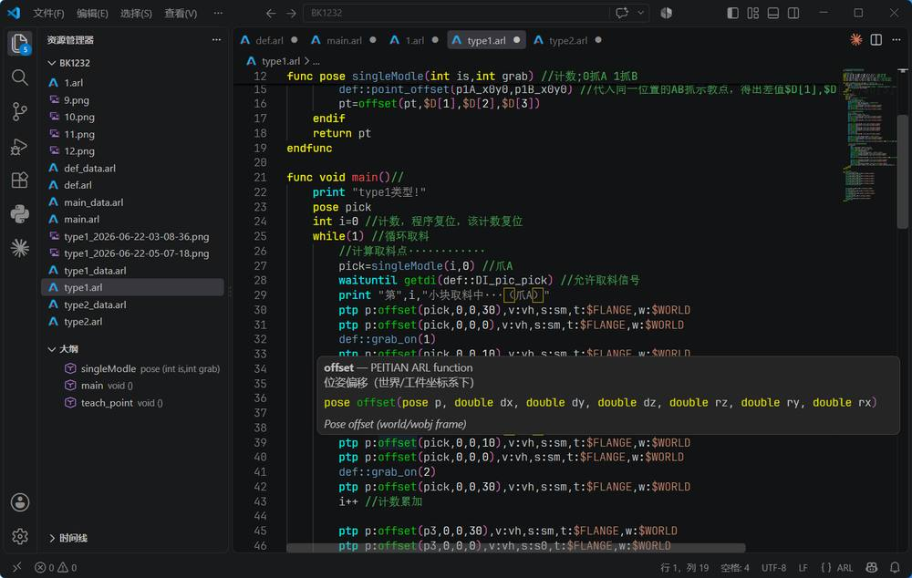
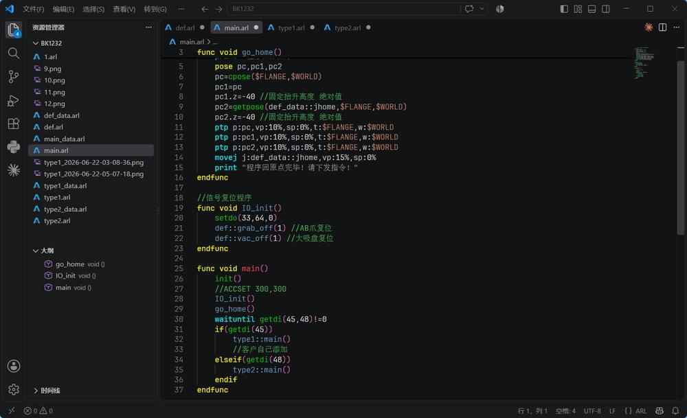
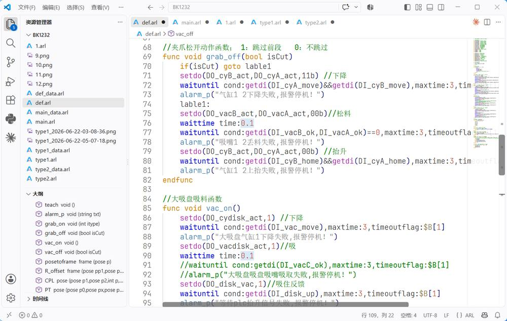
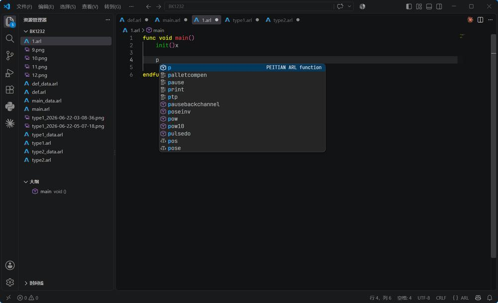
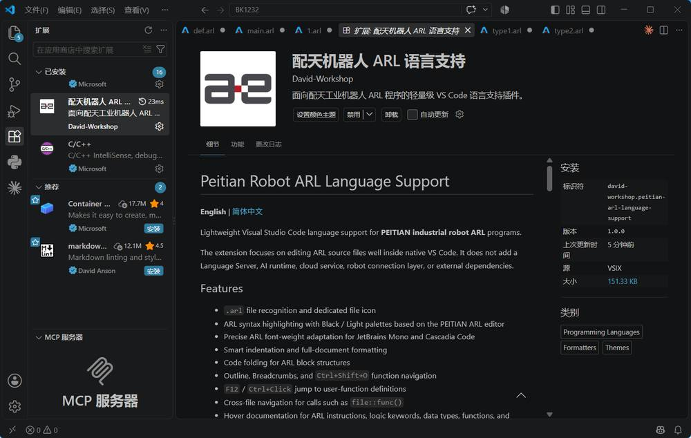

# Peitian Robot ARL Language Support

**English** | [简体中文](https://github.com/YoyoDavidGo/Peitian-Robot-ARL-Language-Support/blob/main/README.zh-CN.md)

Lightweight Visual Studio Code language support for **PEITIAN industrial robot ARL** programs.

The extension focuses on editing ARL source files well inside native VS Code. It does not add a Language Server, AI runtime, cloud service, robot connection layer, or external dependencies.

**Current ARL reference:** ARCS 2.6.6 (Programming Manual v4.5.0).

## Screenshots

### Dark theme · Hover, syntax highlighting, and Outline



### Dark theme · Program overview



### Light theme · Syntax highlighting and Outline



### IntelliSense completion



### Extension details



## Features

- `.arl` file recognition and dedicated file icon
- ARL syntax highlighting with Black / Light palettes based on the PEITIAN ARL editor
- Precise ARL font-weight adaptation for JetBrains Mono and Cascadia Code
- Smart indentation and full-document formatting
- Code folding for ARL block structures
- Outline, Breadcrumbs, and `Ctrl+Shift+O` function navigation
- `F12` / `Ctrl+Click` jump to user-function definitions
- Cross-file navigation for calls such as `file::func()`
- Hover documentation for ARL instructions, logic keywords, data types, functions, and system variables
- IntelliSense for ARL keywords, instructions, functions, variables, and system variables
- Type-aware completion for named robot-motion parameters
- Optional Smart Completion templates for motion instructions, functions, and control blocks
- Signature Help for built-in ARL calls and user functions

## Type-aware completion

ARL completion stays intentionally predictable.

In free input, suggestions start only after at least one character has been typed:

```arl
p
```

This can suggest items from multiple ARL categories such as `ptp`, `pose`, `print`, and matching declared variables.

When the parameter type is already known, suggestions are filtered by ARL type:

```arl
pose pHome
pose pPick
joint jHome
speed vFast

ptp p:p
```

The `p:` context accepts `pose`, so the list contains matching declared `pose` variables such as `pHome` and `pPick`, not unrelated instructions or `joint` / `speed` variables.

For motion parameters with engineering units, Smart Completion keeps the unit outside the editable placeholder. A value parameter can be either a numeric literal or a declared `double` variable. For example, both forms are valid:

```arl
lin p:p1,vl:650mm/s,sl:11mm,t:$FLANGE,w:$WORLD
lin p:p1,vl:vLinearmm/s,sl:sBlendmm,t:$FLANGE,w:$WORLD
```

For Wizard-driven single-line Smart Completion, **Tab** moves to the next parameter. The parameter stays quiet until you type its first character; then VS Code shows strictly prefix-matched, type-compatible candidates. **Enter** inserts the new line and exits the Smart snippet session, so the previous parameter no longer remains highlighted.

In a typed parameter slot, an empty prefix shows no candidates. After the first character is typed, identifier, system-variable, and numeric input all use strict prefix filtering: typing `p` keeps only `p...` pose variables, typing `$` keeps only system-variable candidates, and typing `22` cannot leave an unrelated numeric candidate such as `250` selected. Indexed system-variable arrays such as `$P` insert as `$P[]` with the cursor inside the brackets. Previously used indexed values such as `$P[21]` can be reused when their typed prefix matches.

Chinese/full-width punctuation inside ARL strings and comments is treated as normal text; VS Code Unicode-confusable highlighting remains available for actual code tokens.

Current typed parameter filters include:

| Context | Expected type |
| --- | --- |
| `p:` | `pose` |
| `j:` | `joint` |
| `v:` | `speed` |
| `s:` | `slip` |
| `t:` | `tool` |
| `w:` | `wobj` |

For typed parameter completion, variables come from the current ARL file plus its paired `<program>_data.arl` file in the same directory. The paired data file is cached in memory, so unrelated ARL programs do not pollute the suggestion list.

## Smart Completion

`Peitian Robot ARL › Smart Completion` is enabled by default and can be turned off independently from normal IntelliSense.

When enabled, common ARL structures can be inserted as editable snippets. For example, `ptp` provides two templates:

```arl
ptp p:,vp:,sp:,t:,w:
ptp p:,v:,s:,t:,w:
```

The fixed ARL structure (`p:`, `v:`, `s:`, `t:`, `w:`) is inserted automatically, but every value is an editable tab stop. Empty parameters do not open suggestions. Type the first character to start type-aware, strict-prefix completion; or simply continue typing your own variable name/value. Smart Completion never restricts input to the suggestion list.

For direct-value motion templates, fixed units such as `%`, `mm/s`, and `mm` are inserted automatically outside the editable numeric tab stop. For example, changing `30` to `50` yields `vp:50%` without retyping `%`. Literal templates use a Value icon, while variable templates use a Variable icon in IntelliSense.

Smart Completion is now **Wizard-driven**. The extension packages the complete ARL Wizard metadata embedded in the reference PEITIAN ARL editor — parameter type, required/optional status, variants, documented candidates, units, and descriptions — and maps it into native VS Code snippets and IntelliSense. Motion instructions keep their curated templates. The original editor's TIPS prototype is used only as a safe fallback when a function has no detailed Wizard variant, so all 131 built-in ARL functions have source-driven Smart structure without inventing undocumented signatures.

For example:

```arl
waituntil cond:getdi(1)
setdo(1, 1)
offset(p1, dx, dy, dz, rz, ry, rx)
```

Instructions with optional parameters expose a concise required-only form and a full editable form. Functions with multiple Wizard variants, such as single-channel and multi-channel `setdo`, expose separate Smart Completion entries.

The generic proto parser also preserves overloads (for example zero-argument and ranged `rand` forms), optional arguments, array parameters, and shorthand repeated types used by the original ARL references. When Wizard and TIPS disagree, the detailed Wizard parameter table takes precedence; for example, `connect` uses `connect(socket, host, port)`.

Parameter candidates use one common source priority across Wizard-driven completion: **(1)** current type-compatible declared variables, **(2)** Wizard-documented candidates, and **(3)** recent values that still exist in nearby source code for the same instruction parameter. The list is shown only after the first character is typed, and all three sources are then filtered by that strict prefix. Deleted/transient inputs are not kept as persistent type-wide history, and unrelated builtin scalar system variables are not injected into primitive parameters.

Wizard units also apply to manual parameter completion: accepting `250` or a declared `double` variable in `vl:` inserts the fixed `mm/s` suffix automatically; the same rule applies to `%` and `mm` parameters.

Control structures such as `if`, `while`, `for`, `loop`, `repeat`, `switch`, and `func` continue to provide complete block templates.

Turning Smart Completion off keeps normal ARL IntelliSense, type-aware variable filtering, Hover, Signature Help, formatting, and navigation unchanged.

## Editing shortcuts

The extension uses normal VS Code shortcuts:

| Action | Windows / Linux |
| --- | --- |
| Toggle line comment (`//`) | `Ctrl+/` |
| Format document | `Shift+Alt+F` |
| Trigger IntelliSense | `Ctrl+Space` |
| Trigger Signature Help | `Ctrl+Shift+Space` |
| Go to definition | `F12` |
| Document symbols | `Ctrl+Shift+O` |
| Fold current region | `Ctrl+Shift+[` |
| Unfold current region | `Ctrl+Shift+]` |
| Fold all | `Ctrl+K`, then `Ctrl+0` |
| Unfold all | `Ctrl+K`, then `Ctrl+J` |

ARL line comments use `//`; block comments use `/* ... */`.

## Formatting

`Shift+Alt+F` formats the complete ARL document using the same core block semantics as the PEITIAN ARL editor:

```text
OPEN:  func / if / while / for / loop / switch / repeat / interrupt / timer / trigger
CLOSE: endfunc / endif / endwhile / endfor / endloop / endswitch / until
BRANCH: elseif / else / case / default
```

Compact single-line forms such as `if(cond) action` are kept from incorrectly increasing the following line's indent.

## Hover and navigation

Hover help is available for ARL instructions, functions, logic keywords, data types, and built-in system variables. The descriptions are based on the ARL Wizard reference used by the PEITIAN ARL editor.

User functions are recognized from declarations such as:

```arl
func pose calcOffset(pose src, double dx)
    ...
endfunc
```

`F12` and `Ctrl+Click` jump to local definitions. Cross-file calls such as `def::point_offset()` can resolve to the matching ARL file in the current project.

## Colors and themes

ARL uses standard TextMate scopes and also provides two optional color themes:

- **Peitian ARL Black**
- **Peitian ARL Light**

The extension also maps ARL-only token colors onto common built-in VS Code dark/light themes. Other programming languages are not recolored by these ARL rules.

Bracket-pair rainbow coloring is disabled for ARL so `()`, `[]`, and `{}` keep the fixed ARL bracket color.

## Font weight

`Peitian Robot ARL: Precise Font Weights` is enabled by default.

When the editor font is JetBrains Mono or Cascadia Code / Cascadia Mono, ARL tokens use differentiated numeric font weights that better match the PEITIAN ARL editor. Other fonts are left unchanged.

Recommended examples:

```json
"editor.fontFamily": "'JetBrains Mono', Consolas, monospace",
"editor.fontWeight": "200"
```

or:

```json
"editor.fontFamily": "'Cascadia Code', Consolas, monospace",
"editor.fontWeight": "300"
```

## Privacy and network access

This extension:

- does **not** send ARL source code over the network;
- does **not** include telemetry;
- does **not** call an AI service;
- does **not** require a language server;
- has no production npm dependencies.

All language processing is performed locally in VS Code.

## Scope

This extension is intentionally a lightweight ARL language-support extension. It does not currently provide robot online control, program execution, debugging, full semantic diagnostics, symbol rename, reference search, or AI code generation.

## Compatibility

- Visual Studio Code `1.85.0` or newer
- Windows, macOS, and Linux
- ARL files using the `.arl` extension

## Installation

After Marketplace publication, search Extensions for:

**Peitian Robot ARL Language Support**

For local testing, use **Extensions → ... → Install from VSIX...** and select the packaged `.vsix` file.

## Source and license

The source repository is public for transparency, issue reporting, and reference. Copyright is retained by the author; see [LICENSE](./LICENSE) for the applicable terms. PEITIAN / 配天 names, trademarks, official documentation, and other third-party materials remain the property of their respective rights holders.

## Support

Use the [GitHub Issues](https://github.com/YoyoDavidGo/Peitian-Robot-ARL-Language-Support/issues) page for bug reports and feature requests. When reporting a problem, include the VS Code version, extension version, operating system, a minimal ARL snippet, and a screenshot for visual issues. Do not post confidential customer robot programs or credentials in public reports.
